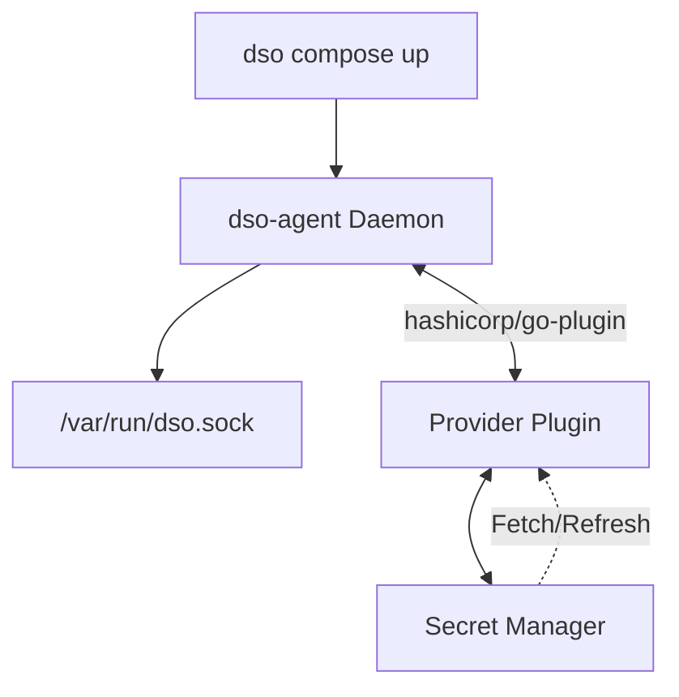

# Docker Secret Operator (DSO)

[](https://go.dev/)
[](https://opensource.org/licenses/MIT)

**Docker Secret Operator (DSO)** is an open-source DevOps tool designed to bring Kubernetes External Secrets functionality to pure Docker and Docker Compose environments without requiring Kubernetes. 

It retrieves secrets from external cloud secret managers and injects them seamlessly into Docker containers at runtime, providing native secret rotation, caching, and multi-cloud provider support.

---

## 1. Architecture Overview


The ecosystem relies on an extensible plugin system. The `dso-agent` communicates with standalone provider plugins over `gRPC` via Unix sockets, enabling safe fetching and caching from backing cloud vaults.

---

## 2. Installation Guide

You can easily install the core binaries and cloud provider plugins onto a standard Linux server (such as an AWS EC2 instance).

```bash
# Clone the repository
git clone https://github.com/umairmd385/docker-secret-operator.git
cd docker-secret-operator

# 1. Install standard CLI and Agent
go build -o dso cmd/dso/*.go
go build -o dso-agent cmd/dso-agent/*.go
sudo mv dso dso-agent /usr/local/bin/

# 2. Create the secure plugin directory
sudo mkdir -p /usr/local/lib/dso/plugins
sudo chmod 755 /usr/local/lib/dso/plugins

# 3. Install Provider Plugins (e.g., AWS, Azure, Huawei)
cd cmd/plugins/dso-provider-aws && go build -o ../../../dso-provider-aws main.go && cd ../../../
cd cmd/plugins/dso-provider-azure && go build -o ../../../dso-provider-azure main.go && cd ../../../
cd cmd/plugins/dso-provider-huawei && go build -o ../../../dso-provider-huawei main.go && cd ../../../

sudo mv dso-provider-aws dso-provider-azure dso-provider-huawei /usr/local/lib/dso/plugins/
```

---

## 3. Agent Deployment

To retrieve your secrets securely without stalling containers on API calls, DSO requires the background daemon to be active.

**Running Manually:**
```bash
# Run the agent locally
sudo dso-agent --config /etc/dso/dso.yaml
```

**Production systemd Service (`/etc/systemd/system/dso-agent.service`):**
To ensure automatic startup securely, orchestrate it via `systemd`.
```ini
[Unit]
Description=Docker Secret Operator Agent
After=network.target

[Service]
Type=simple
ExecStart=/usr/local/bin/dso-agent --config /etc/dso/dso.yaml
Restart=on-failure
RestartSec=5

# Example Cloud Credentials Context (if not using IAM Profiles)
# Environment="AWS_REGION=us-east-1"
# Environment="AZURE_TENANT_ID=azure-tenant-id"

[Install]
WantedBy=multi-user.target
```
Start and enable the agent: `sudo systemctl daemon-reload && sudo systemctl enable --now dso-agent`

---

## 4. Configuration File Example

You map your secret requirements in a `dso.yaml` configuration file alongside a Docker project. The `provider` flag tells the agent exactly which binary plugin to load dynamically.

Example `dso.yaml`:
```yaml
provider: aws

config:
  region: us-east-1

agent:
  refresh_interval: 2m

secrets:
  - name: my-database-secret
    inject: env
    mappings:
      username: DB_USER
      password: DB_PASSWORD
```

---

## 5. Docker Compose Example

DSO intercepts regular compose behavior and dynamically embeds the variables into your containers.

**`docker-compose.yaml`:**
```yaml
version: '3.8'
services:
  api:
    image: node-api
    environment:
      # Do not define the values here; leave them blank!
      - DB_USER
      - DB_PASSWORD
```

When you execute:
```bash
dso compose up -d
```
The command parses `dso.yaml`, contacts `/var/run/dso.sock`, securely fetches the secrets from the agent's memory cache, limits exposure by skipping storage to disk, and natively injects them utilizing background `syscall.Exec`.

---

## 6. Secret Payload Examples

### AWS Secrets Manager
Most cloud vault interfaces allow JSON key-value objects.
```json
{
  "username": "admin",
  "password": "supersecretpassword"
}
```
**Mappings**: A mapping of `username: DB_USER` in `dso.yaml` explicitly extracts the JSON key `"username"` and populates your container logic with an environment variable named `$DB_USER`.

### Azure Key Vault
If Azure holds a literal connection string or API token instead of JSON:
```text
https://my-production-database-connection-string.com/?auth=123
```
**Mappings**: If the mapping block is fully omitted, DSO automatically passes the entire string value down to your container unparsed (frequently used with `inject: file`).

### Huawei CSMS
Supports JSON outputs identical to AWS. Using AK/SK system env strings or IAM Agency identities natively.

---

## 7. Examples Directory
See the `/examples` repository folder for fully executable sandbox stacks.
- `examples/aws-compose/` - Outlines AssumeRole patterns and parsing JSON maps.
- `examples/azure-compose/` - Demonstrates how API tokens are mounted invisibly as memory-backed files (`tmpfs`) to bypass `docker inspect` limitations.
- `examples/huawei-compose/` - Outlines mapping strings for databases.

Each folder contains a `README.md`, a `dso.yaml`, and a working `docker-compose.yaml`.

---

## 8. End-to-End Example

A complete lifecycle from cloud to running container:

1. **Store your Secret**: 
   Log into AWS Secrets Manager and create a new JSON secret named `production-app-secret` containing `"api_key": "12345"`.
2. **Setup config (`dso.yaml`)**:
   ```yaml
   provider: aws
   config:
     region: us-east-1
   secrets:
     - name: production-app-secret
       inject: env
       mappings:
         api_key: APP_API_KEY
   ```
3. **Start the Agent daemon**:
   ```bash
   sudo systemctl start dso-agent
   ```
4. **Deploy the application**:
   In the directory containing your `dso.yaml` and `docker-compose.yml`:
   ```bash
   dso compose up -d
   ```
5. **Verify Injection**:
   Jump into the running compose container to verify insertion:
   ```bash
   docker exec -it my-running-api-container env | grep APP_API_KEY
   # Output: APP_API_KEY=12345
   ```

---

## 9. Troubleshooting Section

- **"plugin not found"**: The agent dynamically looks up `/usr/local/lib/dso/plugins/dso-provider-<name>`. Ensure you spelled `aws` or `azure` correctly under `provider:` in `dso.yaml`, and that the binary exists and has `chmod +x` execution permission.
- **"authentication failure"**: Validate the host environment variables running the `dso-agent`. For Azure, valid `AZURE_TENANT_ID` is required for `azidentity`. For AWS, standard `~/.aws/credentials` or EC2 Instance Profiles are utilized. You may restart the service to refresh the identity chain.
- **"secret mapping errors"**: Ensure the JSON map structure requested matches the text stored in your vault. If the vault returns an unstructured string instead of JSON, the parsing will fail.
- **"socket permission issues"**: The `dso-agent` creates `/var/run/dso.sock`. Ensure the user firing `dso compose up` belongs to a Unix user group possessing read/write permission to that `.sock` file proxy.
