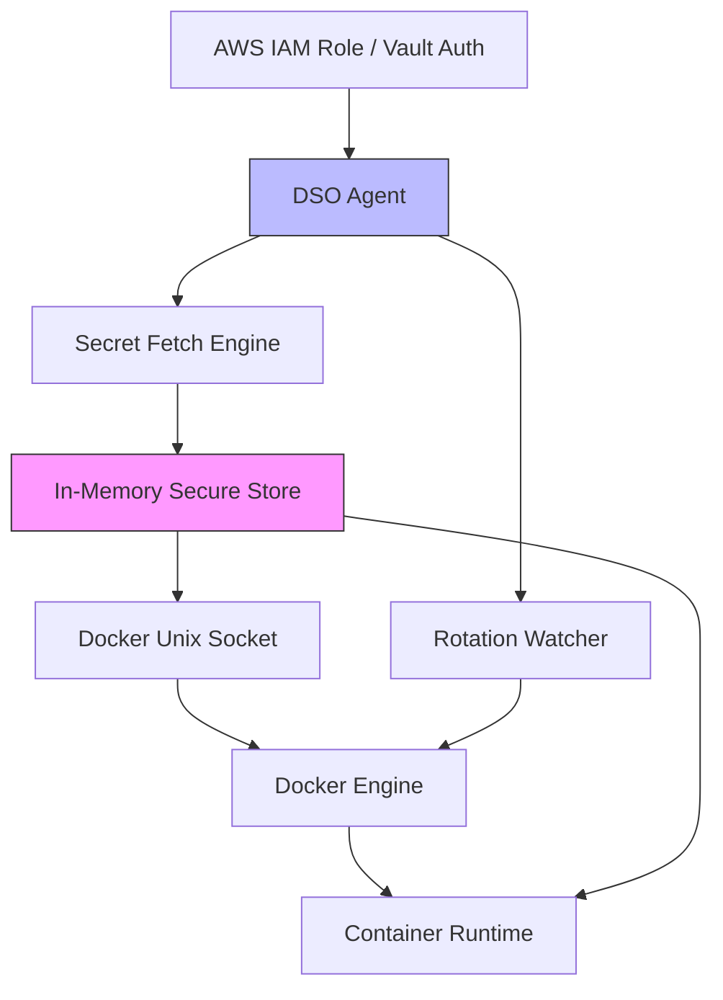

# 🔐 docker-dso

**Enterprise-Grade Secret Management for Docker**

[]()
[](https://github.com/umairmd385/docker-secret-operator/releases)
[](https://opensource.org/licenses/MIT)
[](https://docs.docker.com/engine/extend/)

---

🚫 **Secret Sprawl is killing your security posture.**  
`.env` files, hardcoded credentials, and scattered configs are **SOC2 audit nightmares**.

✅ **docker-dso fixes this.**

👉 Run Docker workloads with:
- Centralized secrets (AWS / Vault / Azure)
- Zero `.env` exposure
- Built-in rotation
- Docker-native workflows

```bash
docker dso up -d
```

> Secure Docker like Kubernetes — **without Kubernetes.**

---

## 🚀 WHAT IS docker-dso?

We've all been there: You're trying to spin up a Docker Compose stack, but you end up hardcoding secret tokens in `docker-compose.yml`, or relying on insecure, committed `.env` files that inevitably leak onto GitHub. To solve this properly, people usually migrate their entire stack to Kubernetes, adopting immense unnecessary complexity.

**docker-dso** solves this. It's a proper, native Docker CLI plugin that hooks directly into Docker Compose to fetch centralized credentials from cloud provider vaults exactly precisely when containers boot. 

It is the missing secret operator for Docker. 

---

## 😡 THE PROBLEM

- **`.env` files leak secrets**: They get accidentally committed, shared insecurely over Slack, and sit plainly unencrypted on local disks.
- **Docker secrets are limited**: Native `docker secret` requires full Docker Swarm mode. They do not natively pull from external cloud backends.
- **Kubernetes is too heavy**: Don't rewrite your infrastructure just to get external secret mapping.

---

## ✅ THE SOLUTION

`docker-dso` makes secret management a native part of your existing Docker ecosystem. By seamlessly mapping cloud provider credentials (like AWS Secrets Manager) directly into simple Compose tags, it eliminates friction securely and intuitively.

---

## ⚔️ COMPARISON TABLE

| Feature                   | Built-in Docker Secrets | docker-dso |
| ------------------------- | ----------------------- | ---------- |
| Works without Swarm       | ❌                       | ✅          |
| External secret providers | ❌                       | ✅          |
| Secret rotation           | ❌                       | ✅          |
| Zero-downtime updates     | ❌                       | ✅          |
| Dev-friendly              | ⚠️                       | ✅          |

---

## 🧠 KEY FEATURES

- **Docker CLI Plugin**: First-party operational feel (`docker dso <cmd>`).
- **Compose Integration**: Parse `docker-compose.yml` natively and inject automatically without wrappers.
- **Secure Injection**: Injects fetched tokens securely and dynamically into tmpfs boundaries or environment variables.
- **Secret Rotation**: Watcher engine detects cloud provider updates, gracefully restarting bounded containers.
- **Multi-Cloud Support**: Connects to AWS Secrets Manager, Azure Key Vault, Huawei CSMS, HashiCorp Vault.

---

## ⚡ Performance & Footprint

docker-dso is built in **Go** with a minimal, efficient runtime design.

### 🧠 Lightweight by Design

- **Memory Footprint**: ~10–30 MB typical runtime
- **CPU Usage**: Near idle (event-driven, not constantly polling)
- **Startup Time**: <100ms injection latency

### ⚙️ Architecture Efficiency

- Uses **in-memory secret storage** (no disk I/O)
- Event-driven watcher minimizes CPU overhead
- Direct Docker socket integration (no proxy layers)

### 📈 What This Means

- No impact on container performance
- Safe for production workloads
- Scales with your Docker environment

> You get Kubernetes-level secret management without Kubernetes-level overhead.

---

## ⚡ QUICK START

```bash
# Initialize limits & configuration natively
docker dso init

# Inject securely and boot your app
docker dso up -d
```

---

## 📦 REAL WORLD EXAMPLE

You declare `dso:` attributes directly inside your generic Compose file.

**`docker-compose.yml`**
```yaml
version: "3.9"

services:
  app:
    image: my-secure-app:latest
    secrets:
      - db_password

secrets:
  db_password:
    # 💥 The Magic Happens Here!
    dso: aws-sm://prod/db/password
```

---

## 🔄 SECRET ROTATION

Hardcoded files get stale. Credentials expire.
`docker-dso` utilizes an **Event-Driven Watcher system** that natively secures rotation endpoints gracefully. 

When you configure rotation:
1. `docker-dso` securely polls or listens via webhook for updates from your cloud provider (e.g. AWS Secrets Manager).
2. It detects structural ID payload shifts cleanly.
3. Automatically performs a *Zero-Downtime Rolling Restart* of any affected container seamlessly.

---

## 🧱 ARCHITECTURE (ENTERPRISE FLOW)



### 🔍 Flow Explained

1. **Authentication Layer**
   * Uses AWS IAM Roles / Vault tokens (no hardcoded credentials)
2. **DSO Agent**
   * Fetches secrets securely at runtime
   * Stores only in memory (no disk persistence)
3. **Docker Integration**
   * Hooks into Docker via Unix socket
   * Injects secrets at container start
4. **Rotation Engine**
   * Watches provider changes
   * Triggers zero-downtime restarts

> No secrets ever touch disk. No `.env`. No leaks.

---

## 🔁 MIGRATION GUIDE

If you used DSO versions 1.x or 2.x, migrating to 3.x is exceptionally simple:

From:
```bash
dso apply
dso fetch my-secret
dso compose up -d
```

To:
```bash
docker dso apply
docker dso fetch my-secret
docker dso up -d
```

The legacy `dso` binary is officially deprecated.

---

## 🛠️ Troubleshooting

### ❌ Issue: AWS Secret Not Fetching

**Error Example:**
```text
AccessDeniedException: User is not authorized
```

### ✅ Solution

Ensure your IAM role or user has:

```json
{
  "Effect": "Allow",
  "Action": [
    "secretsmanager:GetSecretValue",
    "secretsmanager:DescribeSecret"
  ],
  "Resource": "*"
}
```

---

### ❌ Issue: Docker Socket Permission Denied

**Fix:**

```bash
sudo usermod -aG docker $USER
newgrp docker
```

---

### ❌ Issue: Secret Not Injected

Checklist:

* ✅ `docker dso up` used (not plain docker compose)
* ✅ Correct `dso:` URI format
* ✅ Network access to provider

---

### ❌ Issue: Rotation Not Working

* Check watcher config
* Ensure provider supports updates
* Validate polling interval

---

> Still stuck? Open a GitHub issue with logs — we respond fast 🚀

---

## 👥 WHO IS THIS FOR?

- **DevOps Engineers** seeking secure operational bounds without extreme scaling costs.
- **Startups** actively avoiding the heavy lift of migrating to Kubernetes.
- **Security-Focused Teams** explicitly trying to eliminate `.env` file credentials.

---

## 🤝 CONTRIBUTING

We strongly encourage community contributions. Refer to `CONTRIBUTING.md` for guidelines on submitting pulls, adding features, and developing plugins.

---

## ⭐ CALL TO ACTION

👉 **Star this repo if you care about secure Docker deployments.** 
Your support fundamentally strengthens the open-source DevOps ecosystem. Stop leaking `.env` files today!

---

## 💼 Support & Enterprise

docker-dso is open-source — but we also provide **enterprise-grade support and customization**.

### 🧩 Enterprise Offerings

- 🔧 Custom secret provider integrations (internal vaults, legacy systems)
- 🏢 Organization-wide policy enforcement (RBAC, audit trails)
- ⚡ Performance tuning for large-scale Docker clusters
- 🔐 Compliance alignment (SOC2, ISO 27001, internal audits)

---

### ☁️ Managed SaaS (Coming Soon)

We are building a **fully managed docker-dso platform**:

- Central dashboard for secret visibility
- Rotation monitoring
- Audit logs & compliance reports
- Multi-environment orchestration

👉 **Join the waitlist:** (link pending)

---

### 📩 Consulting / Support

Need help integrating docker-dso in your infra?

👉 Reach out:
- GitHub Discussions
- LinkedIn
- Email (founder@example.com)

---

> Secure your Docker stack before your next security audit does it for you.
