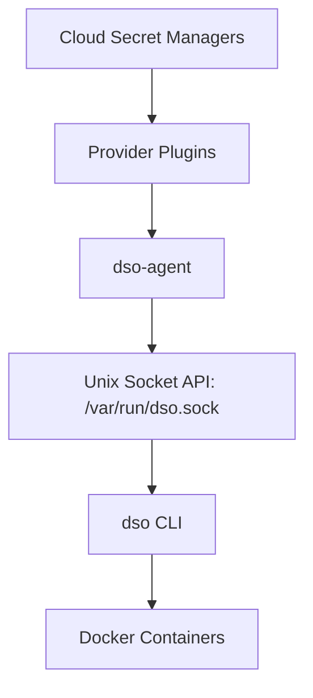

# Docker Secret Operator (DSO)

<p align="center">
  
</p>

[](https://go.dev/)
[](https://opensource.org/licenses/MIT)

**Docker Secret Operator (DSO)** is an open-source DevOps tool designed to bring Kubernetes External Secrets functionality to pure Docker and Docker Compose environments without requiring Kubernetes.  

It retrieves secrets from external cloud secret managers and injects them seamlessly into Docker containers at runtime, providing native secret rotation, caching, and multi-cloud provider support.

---

## 1. Quick Start

Get the system running in minutes:

**1. Install binaries**
```bash
sudo mv dso /usr/local/bin/
sudo mv dso-agent /usr/local/bin/
```

**2. Install provider plugins**
```bash
sudo mkdir -p /usr/local/lib/dso/plugins
sudo mv dso-provider-* /usr/local/lib/dso/plugins
```

**3. Create configuration file**
Create `/etc/dso/dso.yaml` with your provider configuration:
```yaml
provider: aws
config:
  region: us-east-1
secrets:
  - name: my-database-secret
    inject: env
    mappings:
      password: DB_PASSWORD
```

**4. Start dso-agent**
```bash
dso-agent --config /etc/dso/dso.yaml
```

**5. Run docker compose through dso**
```bash
dso compose up
```

---

## 2. Architecture Overview



---

## 3. Installation Guide

To install DSO on a Linux server (e.g., AWS EC2):

1. **Install dso and dso-agent**
   ```bash
   go build -o dso cmd/dso/*.go
   go build -o dso-agent cmd/dso-agent/*.go
   sudo mv dso dso-agent /usr/local/bin/
   ```

2. **Create plugin directory**
   ```bash
   sudo mkdir -p /usr/local/lib/dso/plugins
   sudo chmod 755 /usr/local/lib/dso/plugins
   ```

3. **Install provider plugins**
   ```bash
   (cd cmd/plugins/dso-provider-aws && go build -o ../../../dso-provider-aws main.go)
   (cd cmd/plugins/dso-provider-azure && go build -o ../../../dso-provider-azure main.go)
   (cd cmd/plugins/dso-provider-huawei && go build -o ../../../dso-provider-huawei main.go)
   
   sudo mv dso-provider-aws dso-provider-azure dso-provider-huawei /usr/local/lib/dso/plugins/
   ```

---

## 4. Agent Deployment

You can run the agent daemon manually:
```bash
dso-agent --config /etc/dso/dso.yaml
```

For production deployments, use a systemd service.

Create `/etc/systemd/system/dso-agent.service`:
```ini
[Unit]
Description=Docker Secret Operator Agent
After=network.target

[Service]
ExecStart=/usr/local/bin/dso-agent --config /etc/dso/dso.yaml
Restart=always
User=root

[Install]
WantedBy=multi-user.target
```
Enable and start the service: `sudo systemctl daemon-reload && sudo systemctl enable --now dso-agent`

---

## 5. Plugin Discovery

The `dso-agent` discovers provider plugins by searching the `/usr/local/lib/dso/plugins` directory. It loads binaries matching the pattern `dso-provider-*`.

The `provider` field in your configuration file determines which plugin to use. For example:
```yaml
provider: aws
```
This tells the agent to load the executable named `dso-provider-aws`.

---

## 6. Configuration File Examples

The `dso.yaml` file configures the active cloud provider and maps secrets.

### Example AWS configuration:
```yaml
provider: aws

config:
  region: us-east-1

secrets:
  - name: my-database-secret
    inject: env
    mappings:
      username: DB_USER
      password: DB_PASSWORD
```

### Example Azure configuration:
```yaml
provider: azure

config:
  vault_name: my-key-vault

secrets:
  - name: app-secret
    inject: env
    mappings:
      username: APP_USER
      password: APP_PASS
```

### Example Huawei configuration:
```yaml
provider: huawei

config:
  region: ap-southeast-1
  project_id: my-project

secrets:
  - name: prod-db-secret
    inject: env
    mappings:
      username: DB_USER
      password: DB_PASSWORD
```

---

## 7. Secret Payload Examples

Here is how secrets should be stored in the external managers and mapped to your containers.

### Example AWS secret:
Secret Name: `my-database-secret`

Value:
```json
{
  "username": "admin",
  "password": "securepass123"
}
```

How mappings convert secret keys to container environment variables: The `mappings` dictionary in `dso.yaml` translates the JSON key (`username`) into the container environment variable (`DB_USER`).

---

## 8. Docker Compose Example

DSO dynamically injects secrets into your existing Compose stacks.

**`docker-compose.yaml`**
```yaml
version: "3.9"

services:
  api:
    image: node-api
    environment:
      - DB_USER
      - DB_PASSWORD
```

When you run:
```bash
dso compose up
```

This command will automatically intercept the execution, fetch the secret from the provider via `/var/run/dso.sock`, and inject it securely into the containers in memory.

---

## 9. End-to-End Example

A complete lifecycle from cloud to running container:

**Step 1**
Store secret in AWS Secrets Manager:
Create a JSON secret named `my-database-secret` containing `"password": "securepass123"`.

**Step 2**
Create `dso.yaml` configuration file:
```yaml
provider: aws
config:
  region: us-east-1
secrets:
  - name: my-database-secret
    inject: env
    mappings:
      password: DB_PASSWORD
```

**Step 3**
Start the agent:
```bash
dso-agent --config /etc/dso/dso.yaml
```

**Step 4**
Run containers:
```bash
dso compose up
```

**Step 5**
Verify secrets inside container:
```bash
docker exec -it container env | grep DB
```
*(Output should reveal DB_PASSWORD=securepass123)*

---

## 10. Examples Directory

The repository contains an `examples` folder with fully working setups:
* `examples/aws-compose/`
* `examples/azure-compose/`
* `examples/huawei-compose/`

Each example directory includes its own `dso.yaml`, `docker-compose.yaml`, and a descriptive `README.md` to quickly test configurations out of the box.

---

## 11. Troubleshooting Section

Here are common issues and solutions:

* **plugin not found**: Validate that the plugin binary (e.g., `dso-provider-aws`) exists inside `/usr/local/lib/dso/plugins` and has execution permissions (`chmod +x`). Check your `dso.yaml` `provider` block for typos.
* **authentication failure**: Ensure the `dso-agent` background process has the correct IAM permissions. Validate `~/.aws/credentials`, Azure Managed Identity tokens, or system metrics identity roles attached to the instance executing the daemon.
* **secret mapping errors**: Verify the secret inside your cloud provider is strictly valid JSON format, and that the keys mapped in `dso.yaml` match exactly (case-sensitive). If the stored value is not valid JSON, parsing keys via Mappings will fail.
* **socket permission issues**: If `dso compose up` fails to connect, verify the `/var/run/dso.sock` file exists. Your current user MUST have read/write permissions to the socket. Try starting the daemon / socket with `sudo`.

---

## 12. Publishing the Documentation to GitHub Pages

This repository is pre-configured to automatically generate a beautiful, interactive documentation website via GitHub Pages using Jekyll!

**To turn it on:**
1. Navigate to your repository on GitHub.
2. Click on **Settings** -> **Pages** (on the left sidebar).
3. Under **Build and deployment**:
   - Source: `Deploy from a branch`
   - Branch: `main` (Select `/ (root)` folder).
4. Click **Save**.

Your documentation site will automatically build and publish securely at:
**`https://<your-username>.github.io/docker-secret-operator/`**
