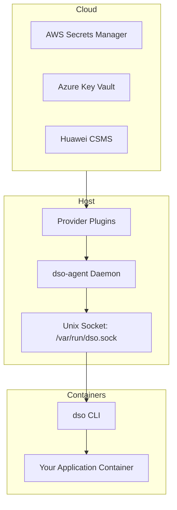

# Docker Secret Operator (DSO)

<p align="center">
  
</p>

[](https://go.dev/)
[](https://opensource.org/licenses/MIT)

**Docker Secret Operator (DSO)** is an open-source DevOps tool designed to bring Kubernetes External Secrets functionality to pure Docker and Docker Compose environments without requiring Kubernetes.  

It retrieves secrets from external cloud secret managers and injects them seamlessly into Docker containers at runtime, providing native secret rotation, caching, and multi-cloud provider support.

---

## 1. Installation

DSO provides a production-grade, one-command idempotent installer for Ubuntu/Debian systems. It automatically handles dependencies (Docker, Go), builds multi-cloud provider plugins, and sets up the background agent as a systemd service.

**Run the installer:**
```bash
curl -fsSL https://raw.githubusercontent.com/umairmd385/docker-secret-operator/main/install.sh | bash
```

### What the installer does:
1. **Dependency Analysis**: Detects and installs missing packages (`docker`, `go`, `curl`, `git`).
2. **Binary Build**: Compiles `dso` (CLI) and `dso-agent` (Daemon) from source.
3. **Plugin Installation**: Builds and installs providers to `/usr/local/lib/dso/plugins`.
4. **Service Setup**: Creates and enables the `dso-agent.service` via **systemd**.

---

## 2. Architecture Overview

DSO acts as a bridge between high-security cloud secret managers and localized Docker environments.



---

## 3. Usage Guide

### A. Configure the Agent
Create `/etc/dso/dso.yaml` (or any local yaml):
```yaml
provider: aws
config:
  region: us-east-1
secrets:
  - name: prod/database/credentials
    inject: env
    mappings:
      password: DB_PASSWORD
```

### B. Inject Secrets into Docker Compose
Update your `docker-compose.yaml` to include the variables you expect:
```yaml
services:
  web:
    image: my-app:latest
    environment:
      - DB_PASSWORD
```

Run compose through the DSO wrapper:
```bash
dso compose up -d
```
*DSO fetches the secret from the agent socket, injects it into the environment, and triggers the compose execution.*

### C. Manual Fetching
```bash
dso fetch prod/database/credentials
```

---

## 4. Service Management

The DSO Agent runs as a background daemon managed by `systemd`.

| Action | Command |
| :--- | :--- |
| **Start Agent** | `sudo systemctl start dso-agent` |
| **Stop Agent** | `sudo systemctl stop dso-agent` |
| **Check Logs** | `journalctl -u dso-agent -f` |
| **Restart** | `sudo systemctl restart dso-agent` |

---

## 5. Security Best Practices

1. **Permissions**: The agent socket `/var/run/dso.sock` is created with strictly managed permissions.
2. **Memory Only**: DSO prefers `inject: env` or `inject: file` via `tmpfs` mounts, ensuring secrets never touch the persistent disk.
3. **IAM Roles**: When running on AWS/Azure, use Instance Profiles/Managed Identities instead of hardcoded API keys.
4. **Scrubbing**: DSO structured logs (Zap) automatically omit secret values.

---

## 6. Uninstallation

To remove all binaries, systemd services, and plugins from your system:
```bash
curl -fsSL https://raw.githubusercontent.com/umairmd385/docker-secret-operator/main/uninstall.sh | bash
```

---

## 5. Plugin Discovery

The `dso-agent` discovers provider plugins by searching the `/usr/local/lib/dso/plugins` directory. It loads binaries matching the pattern `dso-provider-*`.

The `provider` field in your configuration file determines which plugin to use. For example:
```yaml
provider: aws
```
This tells the agent to load the executable named `dso-provider-aws`.

---

## 6. Configuration File Examples

The `dso.yaml` file configures the active cloud provider and maps secrets.

### Example AWS configuration:
```yaml
provider: aws

config:
  region: us-east-1

secrets:
  - name: my-database-secret
    inject: env
    mappings:
      username: DB_USER
      password: DB_PASSWORD
```

### Example Azure configuration:
```yaml
provider: azure

config:
  vault_name: my-key-vault

secrets:
  - name: app-secret
    inject: env
    mappings:
      username: APP_USER
      password: APP_PASS
```

### Example Huawei configuration:
```yaml
provider: huawei

config:
  region: ap-southeast-1
  project_id: my-project

secrets:
  - name: prod-db-secret
    inject: env
    mappings:
      username: DB_USER
      password: DB_PASSWORD
```

---

## 7. Secret Payload Examples

Here is how secrets should be stored in the external managers and mapped to your containers.

### Example AWS secret:
Secret Name: `my-database-secret`

Value:
```json
{
  "username": "admin",
  "password": "securepass123"
}
```

How mappings convert secret keys to container environment variables: The `mappings` dictionary in `dso.yaml` translates the JSON key (`username`) into the container environment variable (`DB_USER`).

---

## 8. Docker Compose Example

DSO dynamically injects secrets into your existing Compose stacks.

**`docker-compose.yaml`**
```yaml
version: "3.9"

services:
  api:
    image: node-api
    environment:
      - DB_USER
      - DB_PASSWORD
```

When you run:
```bash
dso compose up
```

This command will automatically intercept the execution, fetch the secret from the provider via `/var/run/dso.sock`, and inject it securely into the containers in memory.

---

## 9. End-to-End Example

A complete lifecycle from cloud to running container:

**Step 1**
Store secret in AWS Secrets Manager:
Create a JSON secret named `my-database-secret` containing `"password": "securepass123"`.

**Step 2**
Create `dso.yaml` configuration file:
```yaml
provider: aws
config:
  region: us-east-1
secrets:
  - name: my-database-secret
    inject: env
    mappings:
      password: DB_PASSWORD
```

**Step 3**
Start the agent:
```bash
dso-agent --config /etc/dso/dso.yaml
```

**Step 4**
Run containers:
```bash
dso compose up
```

**Step 5**
Verify secrets inside container:
```bash
docker exec -it container env | grep DB
```
*(Output should reveal DB_PASSWORD=securepass123)*

---

## 10. Examples Directory

The repository contains an `examples` folder with fully working setups:
* `examples/aws-compose/`
* `examples/azure-compose/`
* `examples/huawei-compose/`

Each example directory includes its own `dso.yaml`, `docker-compose.yaml`, and a descriptive `README.md` to quickly test configurations out of the box.

---

## 11. Troubleshooting Section

Here are common issues and solutions:

* **plugin not found**: Validate that the plugin binary (e.g., `dso-provider-aws`) exists inside `/usr/local/lib/dso/plugins` and has execution permissions (`chmod +x`). Check your `dso.yaml` `provider` block for typos.
* **authentication failure**: Ensure the `dso-agent` background process has the correct IAM permissions. Validate `~/.aws/credentials`, Azure Managed Identity tokens, or system metrics identity roles attached to the instance executing the daemon.
* **secret mapping errors**: Verify the secret inside your cloud provider is strictly valid JSON format, and that the keys mapped in `dso.yaml` match exactly (case-sensitive). If the stored value is not valid JSON, parsing keys via Mappings will fail.
* **socket permission issues**: If `dso compose up` fails to connect, verify the `/var/run/dso.sock` file exists. Your current user MUST have read/write permissions to the socket. Try starting the daemon / socket with `sudo`.

---

## 12. Publishing the Documentation to GitHub Pages

This repository is pre-configured to automatically generate a beautiful, interactive documentation website via GitHub Pages using Jekyll!

**To turn it on:**
1. Navigate to your repository on GitHub.
2. Click on **Settings** -> **Pages** (on the left sidebar).
3. Under **Build and deployment**:
   - Source: `Deploy from a branch`
   - Branch: `main` (Select `/ (root)` folder).
4. Click **Save**.

Your documentation site will automatically build and publish securely at:
**`https://<your-username>.github.io/docker-secret-operator/`**
