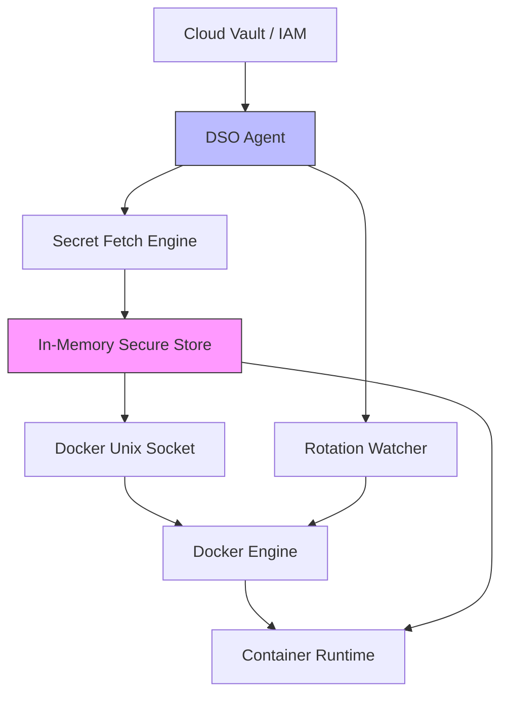

<div align="center">
  

  # 🔐 docker-dso

  **Enterprise-grade secret management for Docker.**
  
  *Stop leaking secrets in `.env` files. No Kubernetes required.*
  
  []()
  [](https://github.com/umairmd385/docker-secret-operator/releases)
  [](https://opensource.org/licenses/MIT)

</div>

---

**docker-dso** is a production-ready Docker CLI plugin designed for DevOps engineers. It natively maps enterprise cloud vaults (AWS, Azure, Vault) directly into your Docker containers at runtime. 

No disk persistence. No leaked credentials. Total compliance.


---

## ⚡ Get Started in 30 Seconds

**1. Install the Plugin**
```bash
curl -fsSL https://raw.githubusercontent.com/umairmd385/docker-secret-operator/main/install.sh | sudo bash
```

**2. Configure your Vault (`/etc/dso/dso.yaml`)**
```yaml
provider: aws
secrets:
  - name: production-db-credentials
    inject: env
    mappings:
      DB_PASS: DB_PASS
```

**3. Run your Compose Stack Natively**
```bash
docker dso up -d
```
*Your containers are now running with securely injected secrets!*

---

## 🎥 The Experience (Live Demo)

We built `docker-dso` to feel like native Docker operations. Here is exactly what the lifecycle looks like.

### 1. Secure Docker in One Command
When you spin up a stack, `docker-dso` dynamically fetches and injects your secrets straight into the container environment boundaries.


### 2. Automatic Secret Rotation
The background Watcher engine continuously monitors your Cloud provider. When a secret changes, it precisely detects the drift and triggers a Zero-Downtime roll.


### 3. Intelligent Strategy Engine
Not all containers can be hot-swapped. The Analyzer profiles your container's metadata (ports, statefulness) to intelligently decide between a seamless rolling update or a safe physical restart.


---

## 🧠 Why docker-dso Exists

We've all been there: You're orchestrating a Docker Compose stack, but you end up hardcoding tokens or relying on insecure, committed `.env` files that inevitably leak onto GitHub. To solve this properly, teams often migrate their entire infrastructure to Kubernetes—adopting immense, unnecessary complexity. 

**`docker-dso` was built to provide K8s-level operational bounds without the K8s overhead.**

---

## 📊 Before vs After

### ❌ Before (The `.env` Nightmare)
- Secrets sit unencrypted on local disks.
- Developers slack each other production keys.
- Impossible to rotate credentials without manually restarting orchestrations.
- Fails SOC2 audits.

### ✅ After (The `docker-dso` Way)
- Secrets are centrally audited in **AWS / Azure / Vault**.
- Fetched dynamically directly into RAM at runtime.
- Automated zero-downtime rotation.
- Enterprise-compliant by default.

---

## 🔥 What Makes docker-dso Different?

- **Zero-Downtime Rollouts**: `docker-dso` doesn't just restart containers. It executes Blue/Green shadow swaps natively in Docker.
- **Docker CLI Native**: First-party operational feel (`docker dso <cmd>`). No wrapper scripts.
- **Event-Driven**: Built in highly-concurrent Go. Immediate reaction to secret drifts via Hash Tracking, equipped with Debouncers to prevent spam.
- **Multi-Cloud**: Write once, securely map anywhere. (AWS Secrets Manager, Azure Key Vault, HashiCorp Vault).

---

## ⚠️ Real-World Constraints 

`docker-dso` intelligently handles the physics of Docker:
- **Port Bindings**: If a container has a fixed host port (e.g., `80:80`), blue/green rolling is physically impossible. The Strategy Engine automatically detects this and falls back to a graceful `restart`.
- **Stateful Mounts**: Containers writing to `/var/lib/mysql` cannot run concurrently. The Analyzer intercepts this risk.

---

## 🔍 Real Runtime Logs

True transparency. Here is exactly what the Intelligent Strategy Engine prints when evaluating a stateful database:

```text
[DSO ANALYZER]
Container: mysql_database_cnt
- Fixed Port: YES
- Stateful: YES

[DSO STRATEGY]
Selected: restart

[DSO ROTATION]
No change detected → skipping
```

---

## 🧱 Enterprise Architecture Flow



---

## 🤝 Contributing

We strongly encourage open-source contributions to expand cloud provider compatibility! 
See `CONTRIBUTING.md` for our architecture guidelines.

---

## ⭐ Support & Enterprise

If `docker-dso` helped secure your infrastructure, please **Star this repo** to help increase developer adoption.

For SOC2 implementation consulting or Enterprise Support:
👉 [Open a Discussion](https://github.com/umairmd385/docker-secret-operator/discussions)
