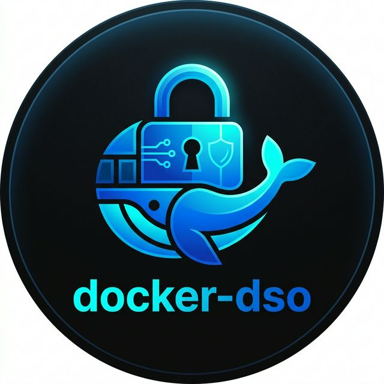
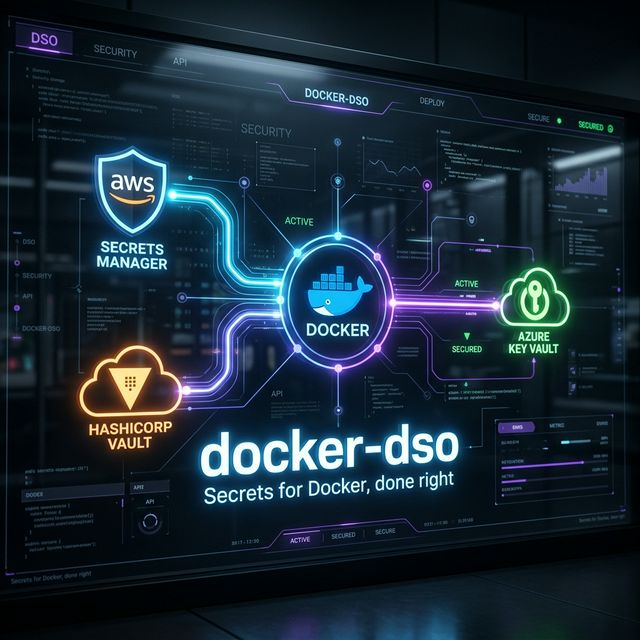
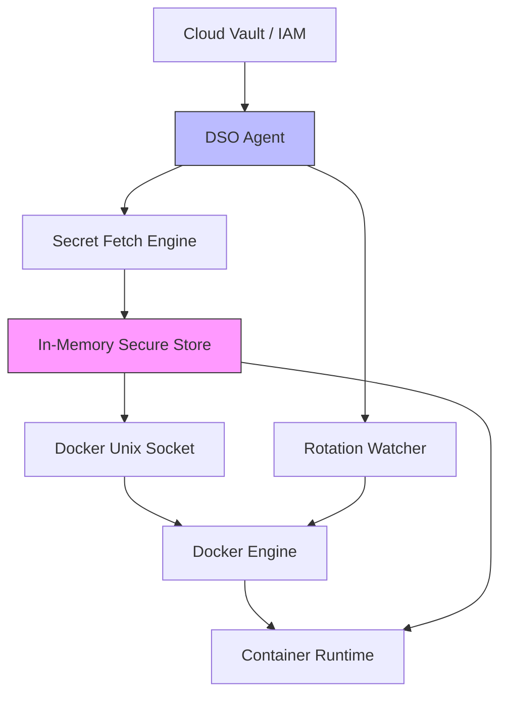

<div align="center">
  

  # 🔐 docker-dso

  **Kubernetes-level secrets for Docker.**
  
  *Stop leaking secrets in `.env` files. Inject directly from cloud vaults at runtime.*
  
  []()
  [](https://github.com/umairmd385/docker-secret-operator/releases)
  [](https://opensource.org/licenses/MIT)

  <br />

  []()
  []()
  []()

</div>

---

**`.env` files are a massive security liability.**
They get accidentally committed, shared insecurely over Slack, and sit plainly unencrypted on developer laptops. **It's a SOC2 audit nightmare.**

**`docker-dso` fixes this.** It is a native Docker CLI plugin designed for DevOps engineers. It maps enterprise cloud vaults (AWS, Azure, Vault) directly into your Docker containers exactly when they boot.

✓ **No disk persistence.**<br/>
✓ **No leaked credentials.**<br/>
✓ **Total compliance.**<br/>



---

## ⚡ Get Started in 30 Seconds

**1. Install the Plugin**
```bash
curl -fsSL https://raw.githubusercontent.com/umairmd385/docker-secret-operator/main/install.sh | sudo bash
```

**2. Configure your Vault (`/etc/dso/dso.yaml`)**
```yaml
provider: aws
secrets:
  - name: production-db-credentials
    inject: env
    mappings:
      DB_PASS: DB_PASS
```

**3. Run your Compose Stack Natively**
```bash
docker dso up -d
```
*Your containers are now running with securely injected secrets!*

---

## 🎥 The Experience (Live Demo)

We built `docker-dso` to feel exactly like native Docker operations. Here is exactly what the operational lifecycle looks like.

### 1. Secure Docker in One Command
When you spin up a stack, `docker-dso` dynamically fetches and injects your secrets straight into the container environment boundaries.


### 2. Automatic Secret Rotation
The background Watcher engine continuously monitors your Cloud provider. When a secret changes, it precisely detects the drift and triggers a Zero-Downtime roll.


### 3. Intelligent Strategy Engine
Not all containers can be hot-swapped. The Analyzer profiles your container's metadata (ports, statefulness) to intelligently decide between a seamless rolling update or a safe physical restart.


---

## 💡 What Just Happened?

When you run `docker dso up -d`, here is the exact flow:

1. **Reads Configuration**: `docker-dso` parses your local `docker-compose.yml` and `/etc/dso/dso.yaml`.
2. **Authenticates**: Connects strictly in-memory to your Cloud Vault using machine roles (e.g., AWS IAM Instance Profiles). No manual passwords involved.
3. **Injects Values**: Dynamically inserts the fetched credentials into your container's environment layer or tmpfs mounts.
4. **Boots Stack**: Passes the enriched environment natively to the Docker Engine to start your workload.

---

## 🧠 Why docker-dso Exists

We've all been there: You're orchestrating a Docker Compose stack, but you end up hardcoding tokens or relying on `.env` files that inevitably leak onto GitHub. To solve this properly, teams often migrate their entire infrastructure to Kubernetes—adopting immense, unnecessary complexity. 

**`docker-dso` was built to provide K8s-level operational bounds without the K8s overhead.**

---

## 📊 Before vs After

### ❌ Before (The `.env` Nightmare)
- Secrets sit unencrypted on local disks.
- Developers Slack each other production keys.
- Impossible to centrally rotate credentials without manually restarting orchestrations.
- Fails SOC2 audits out of the box.

### ✅ After (The `docker-dso` Way)
- Secrets are centrally audited in **AWS / Azure / Vault**.
- Fetched dynamically directly into RAM at runtime.
- Automated zero-downtime rotation built-in.
- Enterprise-compliant by default.

---

## 🔥 What Makes docker-dso Different?

- **Zero-Downtime Rollouts**: `docker-dso` doesn't just restart containers. It executes Blue/Green shadow swaps natively in Docker.
- **Docker CLI Native**: First-party operational feel (`docker dso <cmd>`). No bash wrapper scripts required.
- **Event-Driven & Fast**: Built in highly-concurrent Go. Immediate reaction to secret drifts via Hash Tracking, equipped with Debouncers to prevent spam.
- **Multi-Cloud**: Write once, securely map anywhere. Native support for AWS Secrets Manager, Azure Key Vault, HashiCorp Vault, and Huawei CSMS.

---

## ⚠️ Important Notes (Real-World Constraints)

`docker-dso` intelligently handles the physics of Docker. It understands when zero-downtime updates are physically impossible:

- **Port Bindings**: If a container has a fixed host port (e.g., `80:80`), blue/green parallel rolling is physically impossible due to port collision. The Strategy Engine automatically detects this and falls back to a graceful `restart`.
- **Stateful Mounts**: Containers writing to `/var/lib/mysql` cannot safely run concurrently without data corruption. The Analyzer intercepts this risk and prevents parallel execution.

---

## 🔍 Real Runtime Logs

True transparency. Here is exactly what the Intelligent Strategy Engine prints when evaluating a stateful database:

```text
[DSO ANALYZER]
Container: mysql_database_cnt
- Fixed Port: YES
- Stateful: YES

[DSO STRATEGY]
Selected: restart

[DSO ROTATION]
No change detected → skipping
```

---

## 🧱 Enterprise Architecture Flow



---

## 👥 Who Is This For?

- **DevOps Engineers**: Seeking secure operational bounds and SOC2 compliance without extreme scaling costs.
- **Startups**: Actively avoiding the heavy engineering lift of migrating simple stacks to Kubernetes.
- **Security-Focused Teams**: Explicitly ordered to eliminate `.env` file credentials off developer laptops and servers.

---

## 📈 Adoption & Social Proof

**docker-dso** is built for modern engineering teams. It brings enterprise-grade rotation mechanics to straightforward infrastructure, bridging the gap between basic compose stacks and high-end cloud security standards.

*(Join the growing list of developers keeping secrets off disks. Star the repository to show your support!)*

---

## ☕ Support the Project

`docker-dso` is open-source and maintained by dedicated developers. If this tool has saved your team hours of configuration, improved your security posture, or helped you pass compliance audits—please consider supporting its continuous development.

**You can buy me a Chai to help fuel late-night commits:**

<a href="https://buymeachai.ezee.li/umairmd385" target="_blank">
  
</a>

*All support goes directly toward testing infrastructure, maintaining cloud integrations, and keeping the core product permanently free.*

---

## 🤝 Contributing

We strongly encourage open-source contributions to expand cloud provider compatibility! 
See `CONTRIBUTING.md` for our architecture guidelines.

---

## ⭐ Support & Enterprise

If `docker-dso` helped secure your infrastructure, please **Star this repo** to help increase developer adoption.

For SOC2 implementation consulting or Enterprise Support:
👉 [Open a Discussion](https://github.com/umairmd385/docker-secret-operator/discussions)
