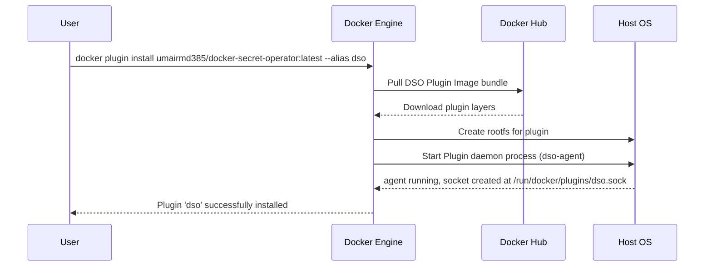
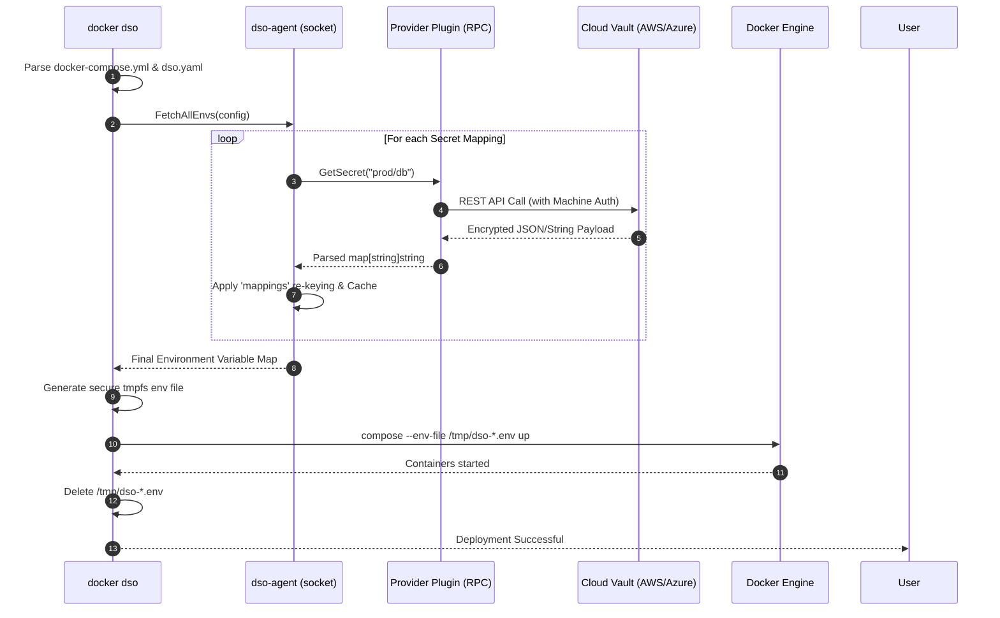
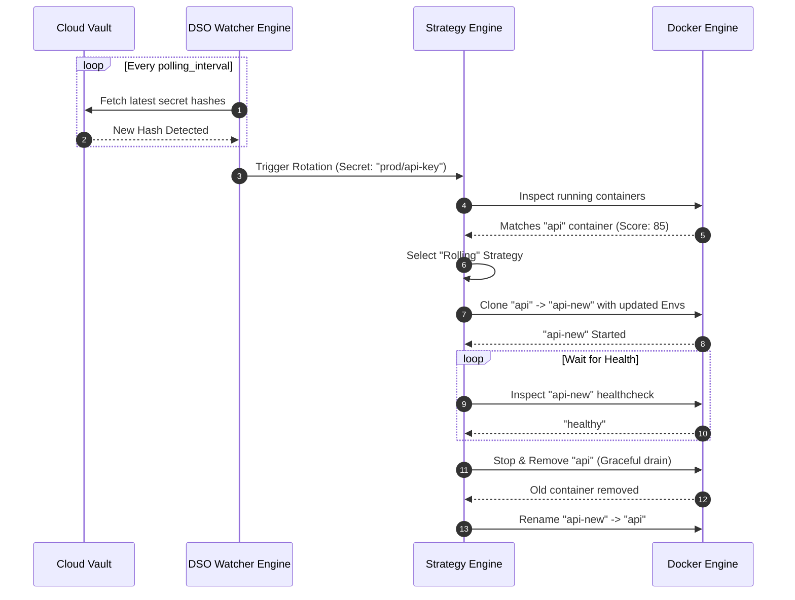

# Architecture & Internals

Docker Secret Operator (DSO) uses a robust client-server architecture, combined with a plugin-based provider system, to securely manage the entire lifecycle of secrets.

This guide provides deep-dive sequence diagrams of the most critical flows.

## Component Overview

DSO consists of three principal logical components:

1. **CLI Plugin (`docker dso`)**: The user-facing tool that intercepts commands, parses configurations, and invokes Docker APIs.
2. **Daemon Agent (`dso-agent`)**: A background service exposing a Unix socket. It handles caching, rotation engines, and provider orchestration.
3. **Provider Plugins (`dso-provider-*`)**: Standalone RPC binaries that execute cloud-specific authentication and retrieval logic.

---

## Installation Flow

The following sequence illustrates how the `docker plugin install` command interacts with Docker Engine and the DSO image bundle.



---

## Secret Fetch and Injection Sequence

When you execute a deployment via `docker dso up`, the following synchronous injection flow occurs to ensure zero disk persistence of plaintext secrets.



---

## Rotation Lifecycle

DSO supports automated secret rotations via its built-in polling and trigger subsystem. The "Rolling" strategy prevents downtime by spawning an updated clone before destroying the old container.



---

## Provider Plugin Architecture

DSO employs HashiCorp's `go-plugin` framework over `net/rpc`. Providers act as completely isolated operating system processes.

```mermaid
graph TD
    subgraph Host System
        A[dso-agent] -->|net/rpc (Unix Socket)| B(dso-provider-aws)
        A -->|net/rpc (Unix Socket)| C(dso-provider-vault)
        A -->|net/rpc (Unix Socket)| D(dso-provider-azure)
    end
    
    B -->|HTTPS| E[AWS Secrets Manager]
    C -->|HTTPS| F[HashiCorp Vault]
    D -->|HTTPS| G[Azure Key Vault]

    classDef agent fill:#f9f,stroke:#333,stroke-width:2px;
    classDef plugin fill:#bbf,stroke:#333,stroke-width:1px;
    classDef cloud fill:#ffe,stroke:#e6a23c,stroke-width:2px,stroke-dasharray: 5 5;
    
    class A agent;
    class B,C,D plugin;
    class E,F,G cloud;
```
