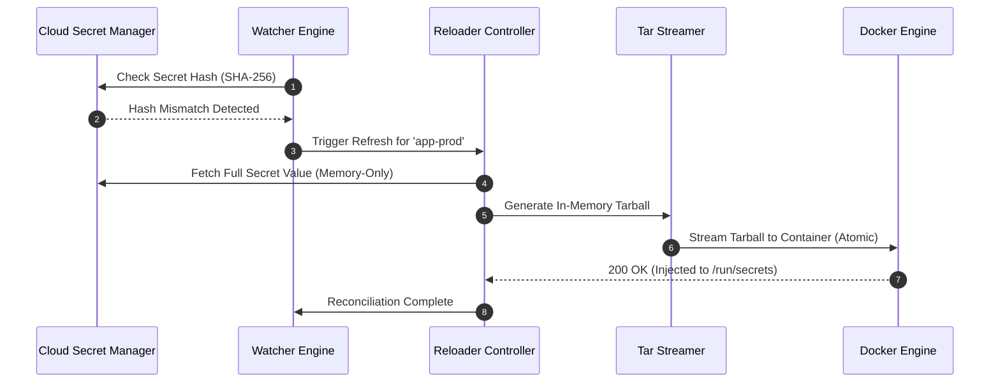
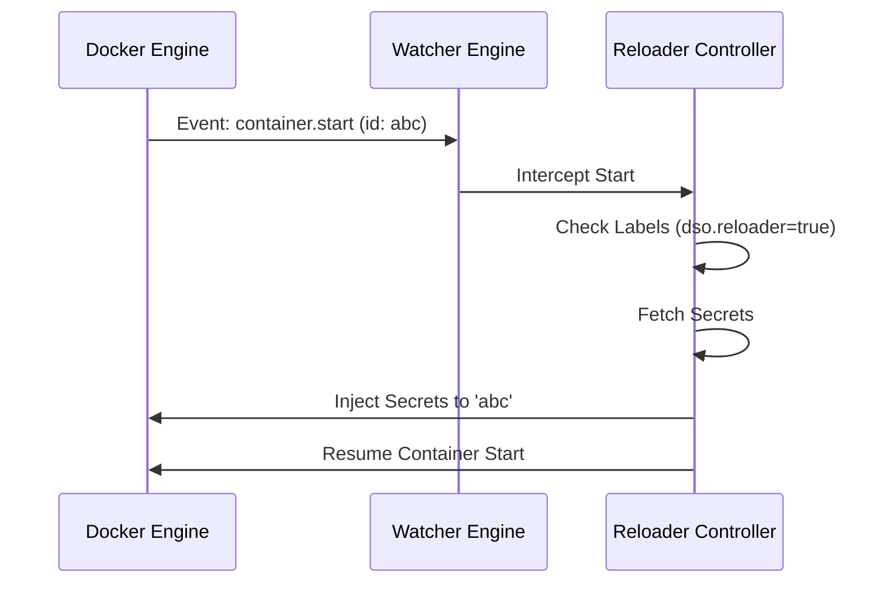

# System Architecture

Docker Secret Operator (DSO) is built on an event-driven, micro-kernel architecture designed for high-security container environments. It operates as a bridge between specialized secret providers (Vaults) and the Docker Engine.

## Core Components

The DSO binary encapsulates four primary internal engines that coordinate the secret lifecycle.

### 1. Watcher Engine
The Watcher is the "Eyes" of the system. It maintains two concurrent observation steams:
- **Provider Stream**: Performs periodic polling/long-polling of cloud secret managers (AWS, Azure, Vault). It uses hashing to detect "Secret Drift" without reading the actual secret value unless a change is confirmed.
- **Docker Event Stream**: Listens to the `/events` endpoint of the Docker Unix socket. This ensures that manually restarted containers or new deployments are immediately intercepted and injected with the latest secrets.

### 2. Reloader Controller
The Reloader is the "Brain" of the system. When the Watcher detects a drift or a new container event, the Reloader:
1.  Identifies affected containers based on labels (`dso.reloader=true`).
2.  Selects an **Atomic Rotation Strategy** (Rolling, SIGHUP, or Restart).
3.  Coordinates the sequence of injection and verification.

### 3. Tar Streamer
The Tar Streamer is the "Hands" of the system and DSO's core security innovation. 
Instead of writing secrets to the host filesystem and mounting them (which risks persistence on disk), the Tar Streamer:
1.  Generates an in-memory TAR archive containing the secret files.
2.  Streams this archive directly into the target container's filesystem via the `CopyToContainer` Docker API.
3.  Injects the files into a `tmpfs` (RAM-backed) mount point within the container.

### 4. Provider RPC Layer
DSO uses a plugin-based provider model. Each provider (AWS, Vault, etc.) runs as an isolated Go process. This ensures that a failure or vulnerability in a specific cloud SDK cannot compromise the core DSO agent or other providers.

---

## Technical Workflows

### The Synchronization Loop (Reconciliation)

### Event-Driven Injection

When a new container starts, DSO intercepts the standard Docker lifecycle to ensure secrets are present before the entrypoint executes.

## Security Boundaries

- **Process Memory**: Secrets reside in the `dso-agent` heap only during the injection window.
- **Unix Socket**: All communication between the DSO CLI and Agent happens over a restricted Unix socket (`/run/docker/plugins/dso.sock`).
- **No Disk I/O**: The system is designed to operate on read-only filesystems. It never requires write access to the host disk for secret handling.

## Next Steps

- **[Security Model](/guide/security)**: Deep dive into the threat mititagtion.
- **[Configuration](/guide/configuration)**: How to define providers and mappings.
- **[Production Readiness](/guide/production-readiness)**: Best practices for deployment.
