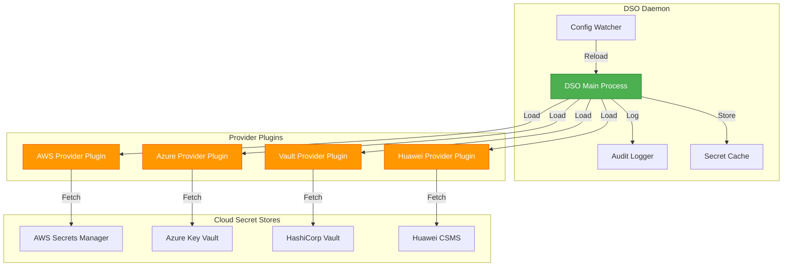
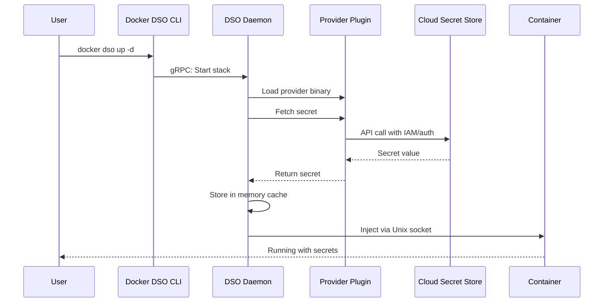
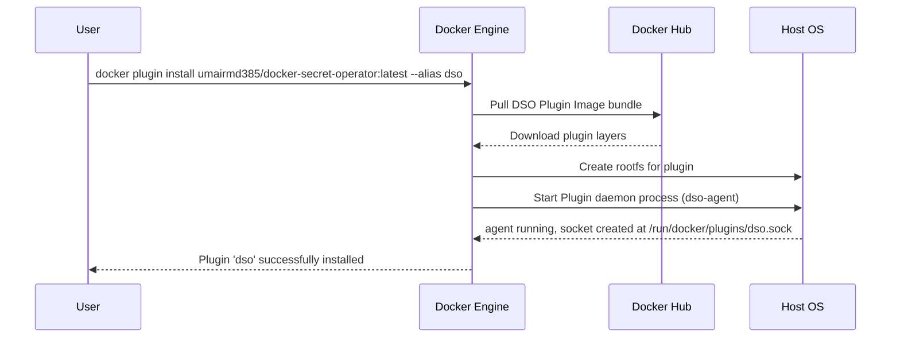
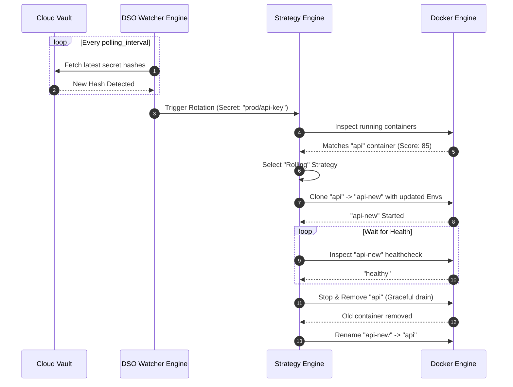

# Architecture & Internals

Docker Secret Operator (DSO) uses a robust client-server architecture, combined with a plugin-based provider system, to securely manage the entire lifecycle of secrets.

This guide provides deep-dive sequence diagrams of the most critical flows.

## Component Overview

DSO consists of three principal logical components:

1. **CLI Plugin (`docker dso`)**: The user-facing tool that intercepts commands, parses configurations, and invokes Docker APIs.
2. **Daemon Agent (`dso-agent`)**: A background service exposing a Unix socket. It handles caching, rotation engines, and provider orchestration.
3. **Provider Plugins (`dso-provider-*`)**: Standalone RPC binaries that execute cloud-specific authentication and retrieval logic.

---

## Provider Plugin Architecture

DSO uses a plugin-based architecture for secret providers. Each provider runs as an isolated Go binary, communicating with the main DSO daemon via RPC.

### Secret Fetch Flow with Plugins

---

## Installation Flow

The following sequence illustrates how the `docker plugin install` command interacts with Docker Engine and the DSO image bundle.

---

## Rotation Lifecycle

DSO supports automated secret rotations via its built-in polling and trigger subsystem. The "Rolling" strategy prevents downtime by spawning an updated clone before destroying the old container.

