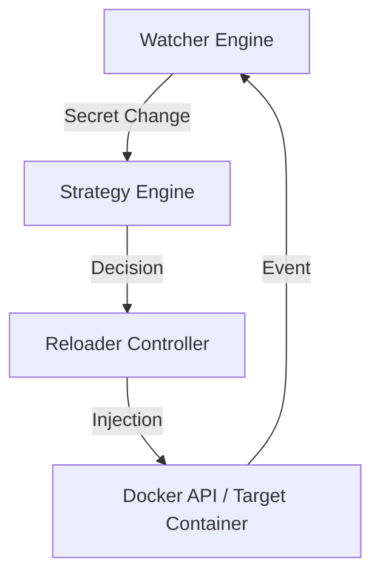

# What is DSO?

**Docker Secret Operator (DSO)** is an event-driven secret lifecycle manager for Docker. It provides a native mechanism to synchronize, inject, and rotate secrets from enterprise vaults (AWS, Azure, HashiCorp Vault) directly into containerized workloads.

DSO is designed to eliminate the risks associated with static secret management, specifically targeting **Secret Proliferation** (credentials left in images, `.env` files, or host storage) and **Secret Drift** (stale credentials in running containers).

## The Core Design: The Control Loop

DSO does not just "copy" secrets; it manages a continuous reconciliation loop that ensures the state of your running containers matches the current state of your secret store.

1.  **Watch**: The system monitors cloud providers for secret updates and the Docker socket for container lifecycle events.
2.  **Analyze**: When a change is detected, the Strategy Engine determines the safest way to rotate the secret (Restart, SIGHUP, or Mount update).
3.  **Inject**: The Tar Streamer securely pushes the new secret into the container's RAMfs-backed secret mount.
4.  **Reconcile**: The system verifies the container's health and ensures the rotation was successful.

## Core Pillars

- **Event-Driven**: Immediate response to secret rotation in the vault or container restarts.
- **Zero-Persistence**: Secrets are stored in-process RAM and injected into `tmpfs`. They never touch the host's physical disk.
- **Docker-Native**: Built to work with Docker Engine and Docker Compose, leveraging native labels (`dso.reloader=true`) and the Docker socket.
- **Least Privilege**: DSO requires only a secure Unix socket connection to Docker and machine-identity-based access to the vault.

## Why DSO?

While Kubernetes has mature secret operators, the Docker ecosystem has historically lacked a professional-grade alternative to insecure `.env` files or manual injection. DSO fills this gap by bringing enterprise-grade secret orchestration to teams running Docker on-premise, on the edge, or in standard cloud instances without the overhead of a full orchestration layer.

## Next Steps

- **[Design Principles](/guide/design-principles)**: Understand the philosophy behind the project.
- **[System Architecture](/guide/architecture)**: Deep dive into the Watcher, Reloader, and Streamer.
- **[Security Model](/guide/security)**: How we protect secrets from host-level compromise.
- **[Quickstart](/guide/getting-started)**: Get running in under 2 minutes.
